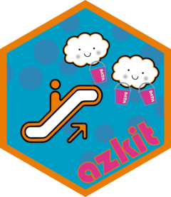

# `{azkit}` 🌊🔑📂📦

<!-- badges: start -->
[![License: MIT][mit_svg]](https://opensource.org/licenses/MIT)
[![Project Status: Active – The project has reached a stable, usable state and is being actively developed][repostatus_svg]][repostatus_info]
![GitHub R package version][gh_ver]
[![R CMD check status][cmd_svg]][cmd_yaml]

[mit_svg]: https://img.shields.io/badge/License-MIT-yellow.svg
[gh_ver]: https://img.shields.io/github/r-package/v/The-Strategy-Unit/azkit
[repostatus_info]: https://www.repostatus.org/#project-statuses
[repostatus_svg]: https://www.repostatus.org/badges/latest/active.svg
[cmd_svg]: https://github.com/The-Strategy-Unit/azkit/actions/workflows/R-CMD-check.yaml/badge.svg?event=release
[cmd_yaml]: https://github.com/The-Strategy-Unit/azkit/actions/workflows/R-CMD-check.yaml
<!-- badges: end -->

An R package to handle Azure authentication and some basic tasks accessing
blob and table storage and reading in data from files.

## Status

The package is in development.
Please [create an issue][issues] if you have ideas for its improvement.

## Installation

You can install the development version of `{azkit}` with:

``` r
# install.packages("pak")
pak::pak("The-Strategy-Unit/azkit")
```

## Usage

A primary function in `{azkit}` enables access to an Azure blob container:

```r
data_container <- azkit::get_container("data-container")

```
Authentication is handled automatically by `get_container()`, but if you need
to, you can explicitly return an authentication token for inspection or re-use:

```r
my_token <- azkit::get_auth_token()

```

```r
data_container <- azkit::get_container("data-container", token = my_token)
```

Return a list of all available containers in your default Azure storage with:

```r
list_container_names()
```

Once you have access to a container, you can use one of a set of data reading
functions to bring data into R from `.parquet`, `.rds`, `.json` or `.csv` files.
For example:

```r
pqt_data <- azkit::read_azure_parquet(data_container, "important_data.parquet")

```

To read in any file from the container in raw format, to be passed to the
handler of your choice, use:

```r
raw_data <- azkit::read_azure_file(data_container, "misc_data.ext")
```

You can map over multiple files by first using `azkit::list_files()` and then
passing the file paths to the `read*` function:

```r
azkit::list_files(data_container, "data/latest", "parquet") |>
  purrr::map(\(x) azkit::read_azure_parquet(data_container, x))
```

Currently these functions only read in a single file at a time.

You can also pass through arguments in `...` that will be applied to the
appropriate handler function (see documentation).
For example, `readr::read_delim()` is used under the hood by
`azkit::read_azure_csv`, so you can pass through a config argument such as
`col_types`:

```r
csv_data <- data_container |>
  azkit::read_azure_csv("vital_data.csv", path = "data", col_types = "ccci")

```

## Environment variables

To facilitate access to Azure Storage you may want to set some environment
variables.
The neatest way to do this is to include a [`.Renviron` file][posit_env] in
your project folder.

⚠️ These values are sensitive and should not be exposed to anyone outside The
Strategy Unit.
Make sure you include `.Renviron` in [the `.gitignore` file][github] for
your project.

Your `.Renviron` file can contain the variables below.
Ask a member of [the Data Science team][suds] for the necessary values.

```
AZ_STORAGE_EP=
AZ_TABLE_EP=
```

## Troubleshooting

Azure authentication is probably the main area where you might experience
difficulty.

To debug, try running:

```r
azkit::get_auth_token()
```
and see what is returned.

`AzureRMR::get_azure_login()` or `AzureRMR::list_azure_tokens()` may also be
helpful for troubleshooting - try them and see if they work / what they reveal.

To refresh a token, you can do:

```r
# if previously you did:
# token <- azkit::get_auth_token()
azkit::refresh_token(token)
```

If you get errors when reading in files, first check that you are passing in
the full and correct filepath relative to the root directory of the container.

If `read_azure_json()` and similar are not working as expected, try reading in
the raw data first with `azkit::read_azure_file()` and then passing that to a
handler function of your choice.


## Getting help

Please use the [Issues][issues] feature on GitHub to report any bugs, ideas
or problems, including with the package documentation.

Alternatively, to ask any questions about the package you may contact
[Fran Barton](mailto:francis.barton@nhs.net).


[posit_env]: https://docs.posit.co/ide/user/ide/guide/environments/r/managing-r.html#renviron
[github]: https://docs.github.com/en/get-started/getting-started-with-git/ignoring-files
[suds]: https://the-strategy-unit.github.io/data_science/about.html
[issues]: https://github.com/The-Strategy-Unit/azkit/issues
